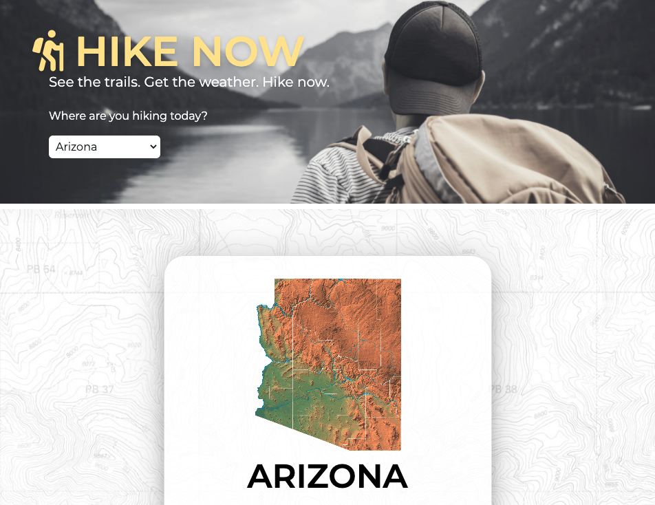

<!-- Project Title and Description -->

<!-- User Story -->
## User Story
AS A hiker
I WANT to select a state to hike in
SO THAT I can view potential trails and the weather to expect

If you've ever wanted to go hiking, whether on vacation and looking for trails where you are or at home and looking for some new scenery, the ability to find trails is a nice asset. 

With Hike Now, you can see the best trails in the state you are in, and get the current weather conditions. 

### How to use it:
* Select the state you're hiking in. 
* See a list of the five best trails in that state based on rating
* Get the current weather conditions 
* See more trails using the button linked to hikingproject.com

### Languages Used:
* HTML
* CSS (TailwindCSS Framework)
* JavaScript (jQuery and Moment.js)

### Application Created by:
* Jamie de Lange
* Lydia Kennedy
* Shelby Kohring

<!-- Identified APIs -->
### Identified APIs
* Open Weather Map
* Hiking Project

### Visit the Hike Now App Here:
[Link: Hike Now](https://kohringsw.github.io/hike-now/)
